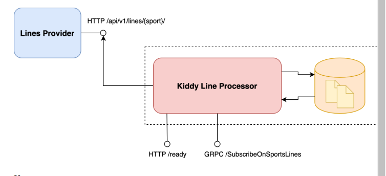

# Line Processor

# TODO
- [x] migration
- [x] github actions ci
- [ ] logging level
- [x] unit test 
- [ ] performance test

# Run
Run docker compose
`make start`

## Stop
stop docker compose
`make stop`

## Test coverage
`make cover`
# Generate go code form proto file
`make proto`
# Lint
`make lint`

# Tests 
`make test`
